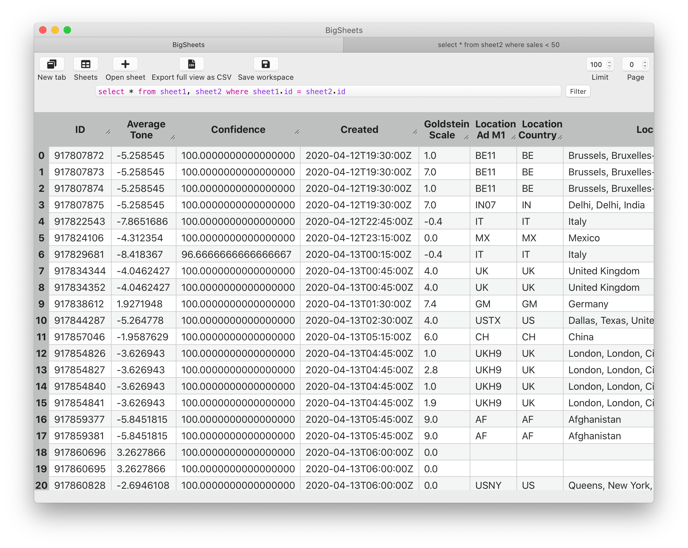

Bigsheets
#########
Open many huge CSV files in a click and query them with the power of
SQL —group by, joins... you name it!

Built as an useful and real exercise to master Domain Driven Design
with Python —if many find it useful though we make it more real.

Download
********

The Mac version is here. Just download it an place it in your
``Applications`` folder.

Installation for developers
***************************
Requirements: ``Python 3.8+`` and not a very old ``nodejs``.

``pip install bigsheets``

Or clone this project and ``pip install -e . -r requirements.txt``.

Building
========
The software is multiplatform, but I have only built it on Mac, and
there is some care to be taken before building it for Windows and Linux:
set the style for Windows and Linux, and setup py2exe for them.

Mac
---
Clone this project and install it with pip.

Export the affinity designer using the export persona selecting the
folder where the affinity designer file is.
Then execute `make icons`, generating the files pyinstaller requires.

Finally execute ``make build``.

Tested in MacOS Catalina.

Architecture
************

This is an app with only one domain: Sheet. If we are
to add more domains we should create a subfolder in bigsheet
like bigsheet/sheet/<move everything here> so we can add 
/bigsheet/domain2/<new stuff> and
a bigsheet/bigsheet.py as the bootstrapper of everything.

Architecture
************
Main thread (pywebview), after init -> "bootstrap" thread (runs first command)

bus for events has a threadpool of max 5 threads, bus for commands uses the same thread as the caller.

pywebview stays in the main thread running the event loop.
pywebview creates a new thread per python call from the JS bridge -> command handler in bus (same thread as before)

